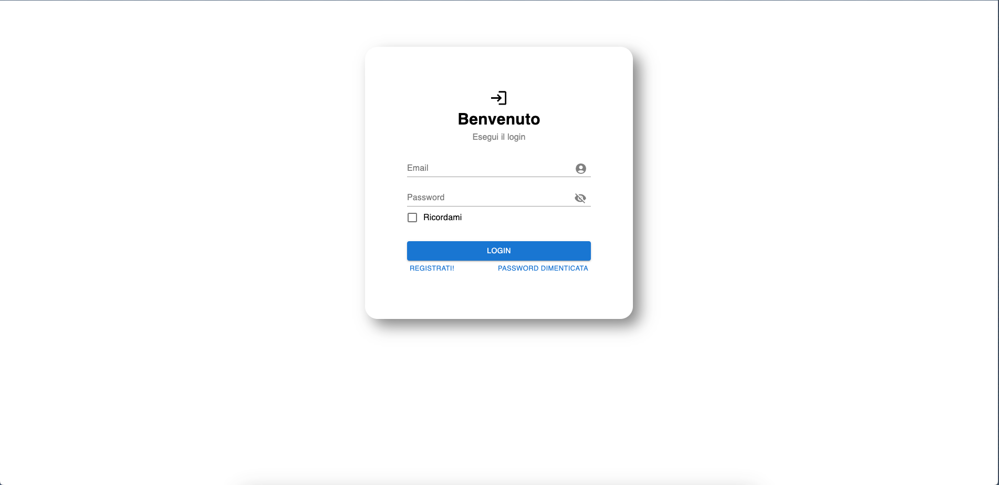

### Fatto con


<h1 align="center" style="font-weight: bold;">Login - Register Form 💻</h1>

<p align="center">
 <a href='#dimostrazione'>Dimostrazione</a> •
 <a href="#tecnologie">Tecnologie usare</a> • 
 <a href="#inizia">Inizia</a>
</p>

<p align="center">
    <b>Un form per accedere o registrarsi in un sito, fatto con MaterialUI</b>
</p>


<h2 id="dimostrazione">🎨 Dimostrazione</h2>

<p align="center">
    
    
</p>

<h2 id="tecnologie">💻 Tecnologie Usate</h2>


<h2 id="inizia">🚀 Inizia</h2>

<h3>Prerequisiti</h3>

Per eseguire il sito è necessario

- [NodeJS](https://nodejs.org/en/)
- [Git](https://git-scm.com/downloads)

<h3>Clona</h3>

Per clonare la repository, copia il comando sottostante

```bash
git clone https://github.com/lraffdev/login-register.git
```

<h3>Inizia</h3>

dal terminale ti basterà eseguire questi due comandi, e il gioco è fatto!

```bash
cd login-register
npm i && npm run dev
```
